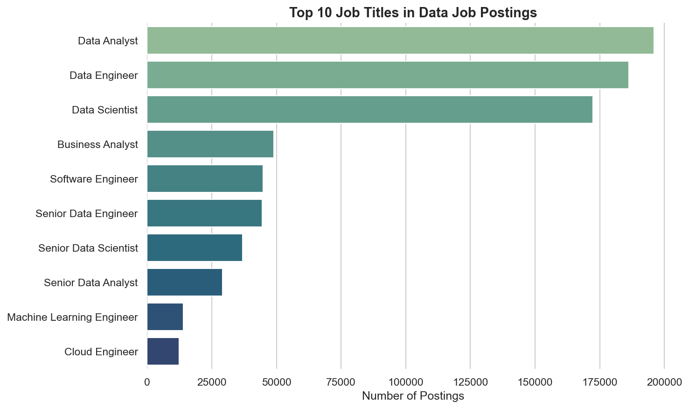
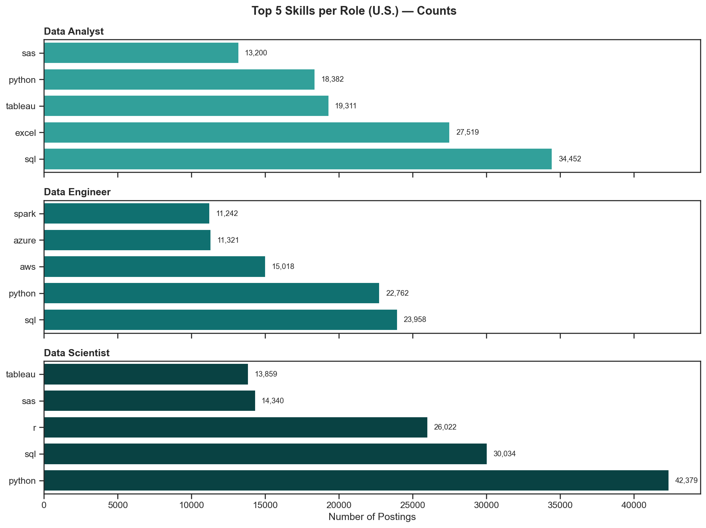
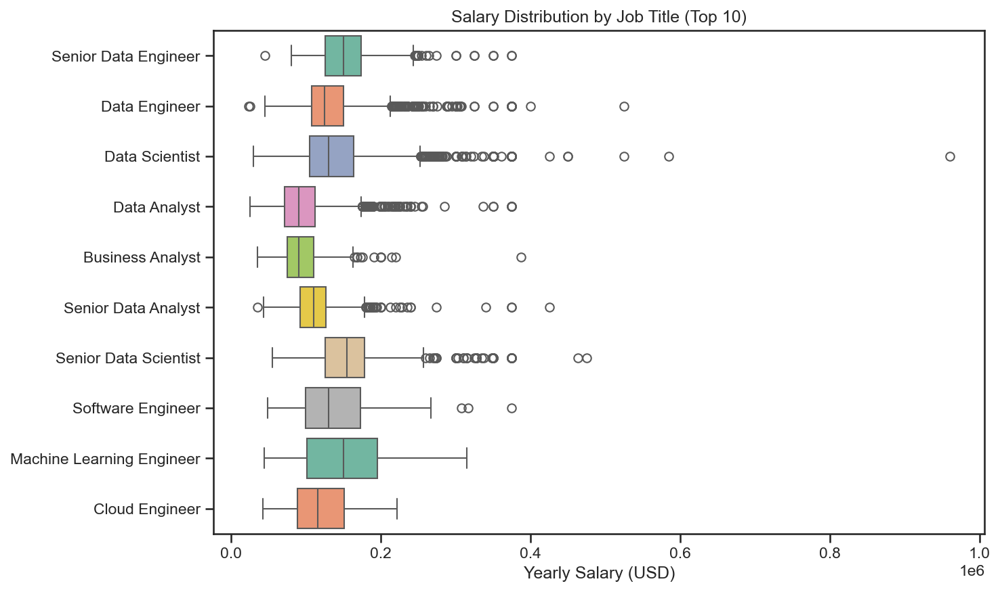
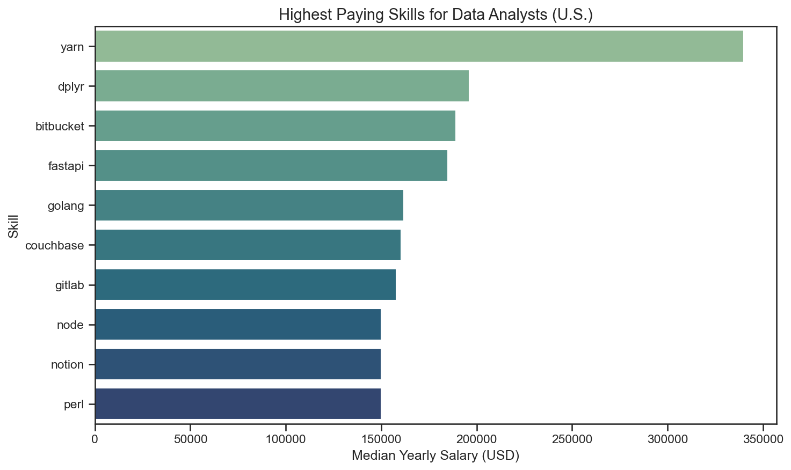

# U.S Data Job Market Analysis with Python
## Overview

This project analyzes the U.S. data job market, with a focus on understanding salary trends, in-demand skills, and how compensation varies by job roles and technologies.

The analysis is based on job postings for data professionals (Data Analysts, Data Scientists, BI Developers, etc.). Through Python scripting and data visualization, I explore patterns that can help job seekers and decision-makers better understand market dynamics.

### Questions I Wanted to Answer

1. What are the most requested skills for Data Analysts in the U.S.?

2. How do those skills affect salary levels?

3. Which tools or technologies offer the highest pay?

4. How does salary vary by job title, location, and company?

5. What insights can help job seekers make more strategic career decisions?


### Tools I Used

- Python – Core scripting language

- Pandas – Data manipulation and cleaning

- Seaborn / Matplotlib / Plotly – Data visualization

- Jupyter Notebooks – Interactive analysis

- Parquet files – Efficient data storage

- VS Code – Development environment

- Git & GitHub – Version control and collaboration

### Environment Setup

I created a virtual environment and installed necessary packages using:

```bash
python -m venv .venv
.venv\Scripts\activate
pip install -r requirements.txt
```

### Importing core libraries

<pre>
# Core data and visualization libraries
import pandas as pd
import matplotlib.pyplot as plt
import seaborn as sns
import numpy as np
import ast
</pre>

### Data Loading(Hugging Face)
<pre>
# Import dataset from Hugging Face
from datasets import load_dataset
dataset = load_dataset("lukebarousse/data_jobs")

# Convert to DataFrame
df = dataset["train"].to_pandas()

# Save to Parquet
df.to_parquet(raw_path / "data_jobs_raw.parquet", index=False)

# Reload from saved Parquet
df = pd.read_parquet(raw_path / "data_jobs_raw.parquet")
</pre>

### Data Cleanup
<pre>
# Strip whitespace and standardize column names
df.columns = df.columns.str.strip().str.lower().str.replace(" ", "_")

# Clean job_skills_column
df['job_skills'] = df['job_skills'].apply(lambda x: ast.literal_eval(x) if isinstance(x, str) else x)

# Convert job_posted_date to datetime format
df['job_posted_date'] = pd.to_datetime(df['job_posted_date'], errors = 'coerce')

# Drop mostly empty columns
df.drop(columns=['salary_hour_avg', 'salary_rate'], inplace = True)

# Drop rows where job_title is missing
df = df.dropna(subset =['job_title'])

#  Fill missing values
df.loc[:,'job_schedule_type'] = df['job_schedule_type'].fillna('Unknown')
df.loc[:,'job_location'] = df['job_location'].fillna('Unknown')
df.loc[:,'job_country'] = df['job_country'].fillna('Unknown')
df.loc[:,'company_name'] = df['company_name'].fillna('Unknown')
df.loc[:,'job_via'] = df['job_via'].fillna('Unknown')
</pre>

This step focused on preparing the dataset for analyis by:
- Standardizing column names for consistency
- Converting date fields to datetime format
- Removing irrelevant or mostly empty columns
- Filling missing values in key categorical fileds with "Unknown"

After cleaning the data, I focused my analysis on U.S based job postings to better understand salary trends and skill demand specific to the U.S market.
<pre>
# Filter for data jobs postings in the United States
df_US = df[df['job_country'] == 'United States'].copy()
</pre>

## Analysis & Visuals

## Key Visual Insights

### Monthly Data Job Postings in the U.S (2023)

To understand hiring patterns and seasonality within the U.S. data job market, I analyzed the number of job postings month-by-month for the year 2023.

This line chart provides an overview of monthly demand for data professionals, helping identify periods of peak hiring and potential slowdowns.

- Job postings were highest in January and steadily declined toward December.

- A notable spike occurred in August, suggesting a late summer hiring push.

- Hiring activity dropped significantly in the last quarter of the year, potentially due to end-of-year budget cycles.
This line chart highlights hiring patterns over time, helping to identify periods of peak demand and seasonal hiring cycles for data-related roles.


### Job Role Distribution
Understanding the distribution of job titles is crucial to identifying the most in-demand roles in the data industry. This chart presents the Top 10 most frequently occurring job titles based on publicly available data job postings across the U.S.

Data Analyst, Data Engineer, and Data Scientist are by far the most sought-after roles, with each exceeding 150,000 postings.

Other prominent roles include Business Analyst, Software Engineer, and senior-level positions such as Senior Data Scientist and Senior Data Analyst.

This distribution provides a clear view of how demand is skewed toward analytical and engineering-focused roles, which can help guide skill-building priorities.




### Top 5 Skills for Leading Data Roles

To better understand the skill demands in the U.S. data job market, this chart highlights the Top 5 most frequently mentioned skills across the three most in-demand roles: Data Analyst, Data Engineer, and Data Scientist.

Data Analysts are expected to be proficient in SQL, Excel, Tableau, Python, and SAS — a mix of data querying, spreadsheet, and BI tools.

Data Engineers lean more toward backend and cloud-oriented tools such as SQL, Python, AWS, Azure, and Spark, reflecting a stronger need for infrastructure and pipeline skills.

This chart demonstrates how role-specific skill sets overlap yet diverge based on the focus — whether it's analysis, engineering, or modeling. It also validates the decision to focus on Data Analyst as a primary role in subsequent sections.



### Salary Distribution by Job Title (Top 10)

This box plot visualizes the salary distribution across the top 10 most common job titles in data-related roles. It provides insight into not only the median salaries but also the range and presence of outliers for each role.

Data Engineers and Data Scientists consistently exhibit higher median salaries and wider salary ranges compared to other roles.

Senior roles (e.g., Senior Data Scientist, Senior Data Engineer) show expected increases in both median and upper-range salaries.

Outliers are prevalent across most roles, indicating that some individuals earn significantly more than the majority — potentially due to experience, industry, or company.

Roles like Business Analyst and Software Engineer display more compact salary ranges, suggesting a narrower pay band for these positions in the dataset.

This chart is especially valuable for salary benchmarking, understanding compensation expectations, and identifying roles with higher earning potential and greater variance.



### Highest Paying Skills for Data Analysts (U.S.)

This bar chart highlights the top-paying technical skills for Data Analyst roles in the United States, ranked by median annual salary.

Tools like Yarn, dplyr, and Bitbucket top the list, offering median salaries well above the $150K mark — indicating demand for hybrid skill sets that blend analytics, scripting, and version control.

The presence of fastapi, golang, and node reflects growing opportunities for analysts who bridge into data engineering, API development, or lightweight backend work.

Traditional scripting and data manipulation tools like Perl, GitLab, and Couchbase also command competitive salaries, albeit less frequently mentioned in entry-level job posts.

Interestingly, several of these high-paying skills are not part of the common Data Analyst toolkit, suggesting that diversifying into adjacent technical domains could offer substantial salary upside.

While demand for these skills may be lower in volume, they appear to command a premium — making them strong candidates for upskilling if salary growth is a key objective.




## Key Takeaways & Insights

1. Seasonal Trends in Hiring
Hiring activity peaks around January and August, with a visible decline toward December, suggesting companies ramp up hiring early and midway through the year
2. Market Demand for Data Roles
Data Analyst, Data Engineer, and Data Scientist roles dominate the U.S. job market, with Data Analyst jobs leading the count. This suggests a strong demand for professionals with foundational data skills across industries.
3. Essential Skill Sets Vary by Role

- Data Analysts are expected to know tools like SQL, Excel, Tableau, Python, and SAS.

- Data Engineers focus on SQL, Python, AWS, Azure, and Spark, reflecting their cloud and pipeline responsibilities.

- Data Scientists favor Python, SQL, Tableau, and Spark, showing a strong mix of analysis and engineering skills.
4. Salary Doesn’t Always Align with Popularity
While Data Analysts dominate in job count, Data Engineers and Data Scientists tend to offer higher salaries, based on the boxplot distribution. This emphasizes the need to balance interest with compensation expectations.
5. High-Paying but Less Common Skills
Technologies such as Yarn, dplyr, Bitbucket, and FastAPI command some of the highest median salaries despite being less frequently listed. These niche tools offer high compensation potential for those willing to specialize.


## Project Structure

This project is organized to maintain a clear workflow that supports reproducibility and clarity. Below is an overview of the key folders and their purposes. 
<pre>
data_jobs/
│
├── data_raw/              # Original datasets before cleaning or transformation (excluded in .gitignore for size/privacy)
├── data_processed/        # Cleaned and processed datasets (.parquet)
├── notebooks/             # Jupyter notebooks for exploration and analysis
├── scripts/               # Reusable Python scripts (e.g. plotting)
|__ images/                # Exported visualizations used in the README
├── requirements.txt       # Python dependencies
└── README.md              # Project documentation
</pre>

## Limitations and Future Enhancements
### Limitations
1. Snapshot Dataset: The dataset used reflects a snapshot in time and may not capture recent trends or changing market demands. 
2. Geographic Bias: While the datset includes global listings, this analyis focused on U.S based roles due to their significantly higher representation. 
3. Missing and Inconsistent Fields: Several job postings had missing values. In particular:
- salary_hour_avg had substantial missing data and was excluded entirely from the analysis
- salary_year_avg, while also incomplete, was retained and analyzed due to its relevance in evaluating compensation trends.

### Future Enhancements
1. Time-Series Analysis: Extend the project using longitudinal job data to identify temporal patterns and market shifts.
2. Salary Estimation Models: Build predictive models to estimate missing salary values using features like job title, company, and skills required.
3. Wider Geographic Analysis: Incorporate and compare data from other regions to offer a more global perspective on job market trends.
4. Job Market Modeling: Implement clustering or classification algorithms to detect emerging job categories or high-demand skill combinations.


# Conclusion
This project provided a comprehensive exploration of data analyst job postings, with a particular focus on roles in the United States. From skill demands to salary trends and job title variations, the analysis offers actionable insights into the state of the data job market. 

Future iterations may expand the scope to global markets, introduce machine learning-based salary predictions, and offer interactive interfaces for end users.

# Acknowledgements

The dataset used in this project was sourced from a public repository on Hugging Face. Credit to the original contributors for curating this valuable resource.

✍️ Author

Olivia Kyeni

Data Analyst

[LinkedIn](www.linkedin.com/in/oliviakyeni)
